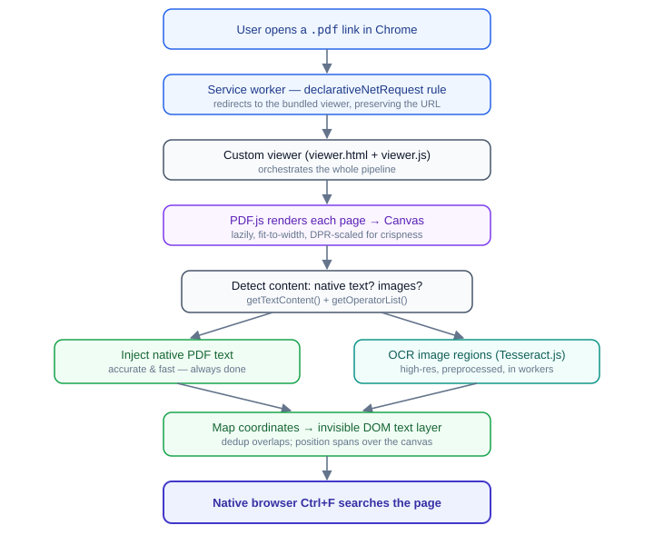
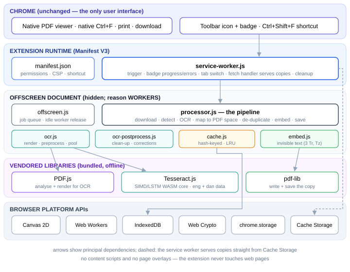

## 5 System Architecture

The extension is a **pipeline** that converts an opaque PDF into searchable DOM text. Conceptually, content flows from a PDF request, through interception and rendering, into a text-detection fork (native text vs. OCR), and finally onto an invisible overlay that the browser searches natively.

### 5.1 Pipeline overview

### 5.2 Component map

The codebase is organised in four layers: the extension runtime, the custom viewer application, the vendored libraries, and the browser platform APIs they build on.

