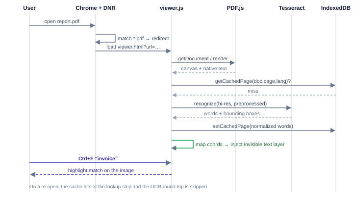

## 5 System Architecture

The extension is a **pipeline** that turns a scanned PDF into a searchable copy of itself and lets Chrome show that copy. The tab keeps showing the original while a hidden offscreen document does the work. When it finishes, the tab is navigated to the copy, which the extension's service worker serves from Cache Storage, so Chrome opens it in its own viewer.

### 5.1 Pipeline overview

### 5.2 Component map

The codebase is organised in layers: Chrome itself (unchanged), the extension runtime, the hidden offscreen document that holds the pipeline, the vendored libraries, and the browser APIs they build on.

### 5.3 Request sequence

Three design points explain the shape of the system:

- **Change the file, not the viewer.** Chrome's viewer cannot be extended, so the only way to keep it is to give it a file that already contains the text.
- **Serve the copy from the extension's own origin.** The first version opened the copy as a `blob:` URL. In real Chrome that navigation silently never completes, because an extension's blob URL can't be opened from an ordinary website tab. The copy URL `chrome-extension://<id>/searchable/<token>/<file name>?src=<original>` works, keeps the tab title (it ends in the original file name), makes restoring trivial, and lets an expired copy fall back to the original.
- **Do the heavy work out of sight.** Rendering and OCR need a DOM and Web Workers, which a service worker lacks, and must not disturb the tab. An offscreen document provides both.
