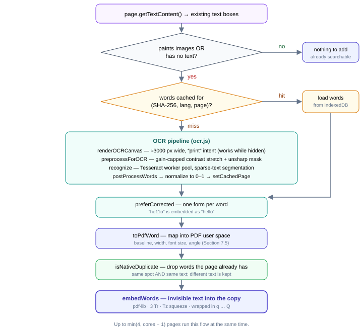
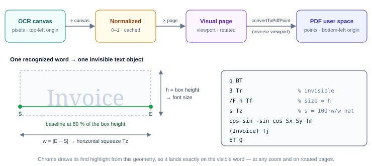
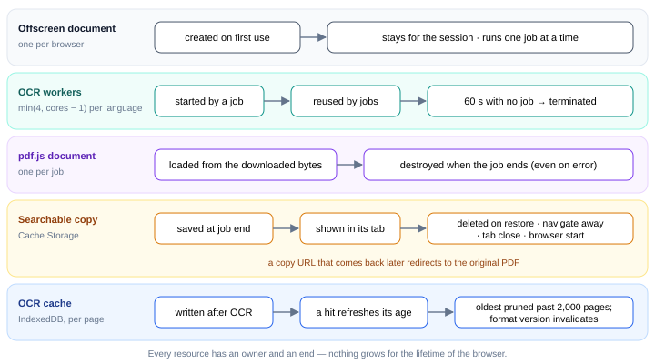

## 7 Implementation Walkthrough

### 7.1 Activation, badge, and restore

The toolbar icon and the shortcut (`Ctrl+Shift+F`; on Mac Control+Shift+F, ⌃⇧F) run one handler, `toggle(tab)`:

- **On a copy** (`chrome-extension://…/searchable/…`): read the original URL from the `src` parameter, delete the copy, navigate back.
- **On anything that isn't a web or file URL:** red badge, "open a PDF in this tab first".
- **On a `file://` URL without file access:** red badge plus the extension's settings page, where "Allow access to file URLs" lives.
- **Otherwise:** start the offscreen document if needed, choose the copy URL and cache key, and send the job.

The badge is per tab: `…` while starting, a percentage while pages are processed, `✓` when done. Errors use a red `!` for 15 seconds, and the tooltip carries the explanation. Chrome clears a tab's badge whenever the tab navigates, so the success badge is set only after the copy has finished loading. A generation counter keeps a delayed reset from wiping a newer badge.

> **Why Control+Shift+F on Mac?** Chrome leaves a suggested `Cmd+Shift+F` unassigned (`chrome.commands.getAll()` reports an empty shortcut, and `chrome://extensions/shortcuts` shows "Not set"). `MacCtrl+Shift+F` is assigned, and gives the same `Ctrl+Shift+F` on every platform.

### 7.2 Download, validation, identity

The offscreen document downloads the tab's URL again with `credentials: "include"`, so signed-in sites return the same file the tab shows. Because many PDFs live at addresses without ".pdf", validation happens on the bytes: the `%PDF-` signature must appear in the first kilobyte. HTML responses are reported as "not a PDF (or a sign-in page)".

The bytes are loaded by PDF.js (analysis and rendering) and pdf-lib (writing), and hashed with SHA-256, all in parallel. Encrypted files are reported clearly, because pdf-lib cannot write into them. pdf-lib's error class is transpiled ES5, so `instanceof` fails on it and the check matches the message instead. The PDF.js loading task is destroyed in a `finally` block, so a long-lived offscreen document never accumulates documents.

### 7.3 Per-page processing



A page is OCR'd when it paints raster images (found in its operator list) **or** has no extractable text at all. Image detection fails open: if the operator list can't be read, the page is OCR'd anyway.

### 7.4 OCR rendering and preprocessing

The page is rendered to an offscreen canvas about 3000 px wide with PDF.js's `"print"` intent. The default intent is paced by `requestAnimationFrame`, which never fires in a hidden document. The image is then preprocessed:

```text
gray = 0.299 R + 0.587 G + 0.114 B
lo, hi = 2nd and 98th percentile of the histogram
R  = max(96, hi − lo)                 # gain floor: at most ~2.7×
v' = 255 − 255 · (hi − v) / R         # anchored at the white point
sharp = v' + (v' − boxBlur(v', r=2))  # unsharp mask, O(n) sliding window
```

The floor on `R` fixed a real failure. On a mostly blank page, text is under 2% of the pixels, so the "2nd percentile" is background too. The uncapped stretch multiplied contrast by up to 127×, turned JPEG noise into black speckle, and made one test page unreadable.

Recognition uses a Tesseract.js scheduler over `min(4, cores − 1)` LSTM workers per language, with sparse-text segmentation (better for tables and scattered text). Workers are terminated 60 s after the job queue empties and recreated on demand.

### 7.5 Mapping words into the PDF



Word boxes are normalized to 0–1 (so cached results don't depend on render size), scaled to the page viewport, and mapped back into PDF user space with PDF.js's inverse viewport transform (`convertToPdfPoint`). That transform already includes page rotation. Four mapped points give everything needed:

- baseline start **S** and end **E** at 80% of the box height → width `w = |E − S|` and angle `θ = atan2(E − S)`;
- box top and bottom → height `h`, used as the font size.

Each word becomes `BT 3 Tr /F h Tf s Tz [cosθ sinθ −sinθ cosθ Sx Sy] Tm (word) Tj ET`, with `s = 100 · w / w_natural` clamped to 1–1000. Chrome's find highlight is drawn from exactly this geometry, so it covers the visible word at any zoom. The block is wrapped in `q … Q` so its text state can't leak into the page.

**De-duplication.** An OCR word is dropped when the midpoint of its baseline lies inside an existing text item's box *and* that item's text contains the word. Different text at the same spot (a caption baked into a figure next to real text) is kept.

### 7.6 Post-processing for findability

Native find is exact-match, so the stored text has to be right. Post-processing drops near-zero-confidence noise and trims non-letter junk from word edges. The trimming uses Unicode letter classes, so Danish "på" stays "på". It also corrects likely digit/letter confusions in mostly-letter words (`he11o` → `hello`, `ca5h` → `cash`). The old DOM viewer injected both forms; inside a real PDF two words at one spot would double Chrome's match count and duplicate copied text, so the copy contains **one** form, the corrected one.

### 7.7 Caching

Words are stored per page in IndexedDB under `<sha256>::<lang>::<page>`, with a format version (bumped whenever the pipeline changes) and a last-used timestamp. Keying by content means the same file reached through two URLs is recognised once, and a changed file at a familiar URL never gets stale words. Empty results are cached too. After every job, the oldest records are deleted until at most 2,000 pages remain.

### 7.8 Serving the copy

```js
self.addEventListener("fetch", (event) => {
  const url = new URL(event.request.url);
  if (url.origin !== self.location.origin || !url.pathname.startsWith("/searchable/")) return;
  event.respondWith(serveCopy(url));
});
async function serveCopy(url) {
  const hit = await (await caches.open(COPY_CACHE)).match(COPY_KEY_ORIGIN + url.pathname);
  if (hit) return hit;
  const src = url.searchParams.get("src");          // copy expired → back to the original
  if (src && isFetchableUrl(src)) return Response.redirect(src, 302);
  return new Response("This searchable copy is no longer available.", { status: 404 });
}
```

Before switching, the service worker checks that the tab still shows the same PDF (the user may have moved on). Chrome receives an `application/pdf` response and opens its own viewer. The URL's last segment is the original file name, so the tab title is unchanged.

### 7.9 Resource lifecycle


